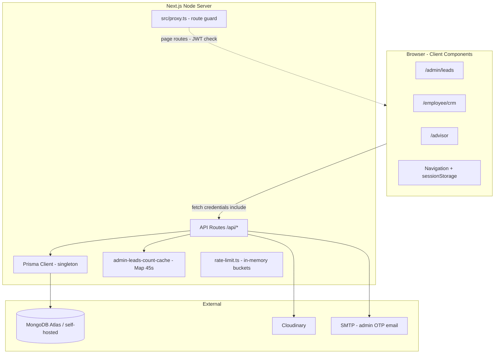
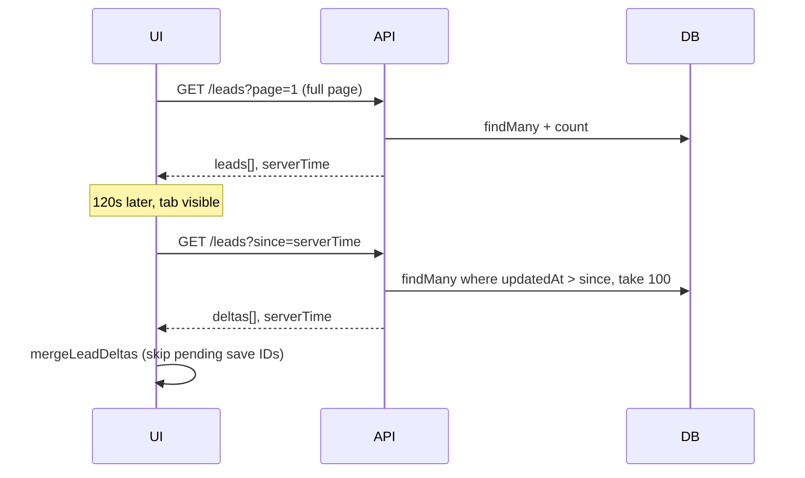

# GDF Internationals / Bee CRM — Architecture & Operations Guide

**Audience:** Senior developers reviewing the system for performance, scaling, and production hardening.  
**Last updated:** May 2026  
**Production scale:** ~40,000+ leads in MongoDB (growing).

---

## Table of contents

1. [Executive summary](#1-executive-summary)
2. [Tech stack](#2-tech-stack)
3. [Deployment & runtime](#3-deployment--runtime)
4. [High-level architecture](#4-high-level-architecture)
5. [Roles & routes](#5-roles--routes)
6. [Authentication & security](#6-authentication--security)
7. [Data model](#7-data-model)
8. [Lead loading patterns (by surface)](#8-lead-loading-patterns-by-surface)
9. [Polling & real-time sync](#9-polling--real-time-sync)
10. [Saving leads (race conditions)](#10-saving-leads-race-conditions)
11. [Caching (current state)](#11-caching-current-state)
12. [Admin leads page (deep dive)](#12-admin-leads-page-deep-dive)
13. [Performance optimizations already applied](#13-performance-optimizations-already-applied)
14. [Known bottlenecks & problems](#14-known-bottlenecks--problems)
15. [Recommended next steps](#15-recommended-next-steps)
16. [API reference (summary)](#16-api-reference-summary)
17. [Environment variables](#17-environment-variables)
18. [Local development & build](#18-local-development--build)

---

## 1. Executive summary

Bee CRM is a **multi-role telemarketing CRM** built on **Next.js 16 (App Router)**, **React 19**, **Prisma 6**, and **MongoDB**. It is deployed primarily on **cPanel shared hosting** using a **standalone Node bundle** (`output: 'standalone'`), launched via root `server.js`.

The system is **not** a static site: all lead operations hit **API routes** that query MongoDB through Prisma. The admin lead pool can be **very large** (~40k+ documents). The UI is optimized around:

- **Server-side pagination** (typically 50 rows per request)
- **Slim list projections** (heavy JSON excluded from list endpoints)
- **Delta polling** on employee/advisor boards (not full reloads)
- **Per-lead save queues** to avoid disposition races
- **In-memory count cache** for admin totals (45s TTL)

There is **no Redis** today. Caching is minimal (in-process `Map`, `sessionStorage`, optional HTTP `Cache-Control` on a few routes).

---

## 2. Tech stack

| Layer | Technology |
|--------|------------|
| Framework | Next.js 16.2 (`App Router`, `output: 'standalone'`) |
| UI | React 19, Tailwind CSS 4, Framer Motion, Lucide |
| API | Next.js Route Handlers under `src/app/api/**` |
| ORM | Prisma 6 → MongoDB |
| Auth | `jose` JWT in `httpOnly` cookies |
| Passwords | `bcryptjs` |
| Files | Cloudinary (uploads, lead documents) |
| Email / OTP | `nodemailer` → admin inbox |
| CSV/Excel import | `papaparse`, `read-excel-file` (lazy-loaded in admin UI) |

---

## 3. Deployment & runtime

### 3.1 Production entry (`server.js`)

```
Repository root/
├── server.js              ← cPanel Node entry (loads .env, sets limits, chdirs to standalone)
├── .env                   ← secrets (not in git)
├── .next/standalone/      ← produced by `npm run build` + postbuild script
│   ├── server.js
│   ├── .next/static
│   ├── public/
│   └── prisma/
└── package.json           ← "start": "node server.js"
```

**`server.js` responsibilities:**

- Load `.env` / `.env.local` / `.env.production` from project root
- Set `UV_THREADPOOL_SIZE=4` (reduces Tokio/worker pressure on shared hosts)
- Set `NODE_OPTIONS` `--max-old-space-size=768` if not already set
- `chdir` into `.next/standalone` and require Next standalone server
- Bind `HOSTNAME=0.0.0.0`, `PORT` from env (default 3000)

### 3.2 Build pipeline

```bash
npm run build          # next build --webpack, cpus: 1 (lower RAM during build)
npm run postbuild      # scripts/prepare-standalone.mjs
npm start              # node server.js
```

`prepare-standalone.mjs` copies into the bundle:

- `.next/static` → standalone
- `public/` → standalone
- `prisma/` → standalone (for `db push` / engines on server)

**Important:** Prisma `binaryTargets` includes `debian-openssl-1.0.x` for Linux cPanel. **Build on the same OS as production** when possible (Windows build → Linux deploy can break Prisma engines).

### 3.3 Hosting constraints (cPanel)

| Constraint | Implication |
|------------|-------------|
| Single Node process | In-memory cache is per-process; lost on restart |
| ~768MB heap cap | Large in-memory selections (5k IDs) are risky |
| Limited CPU | Parallel `count()` + `findMany()` still heavy at 40k+ |
| No local Redis (typical) | External Redis (e.g. Upstash) only if outbound HTTPS allowed |

---

## 4. High-level architecture



### Request flow (typical lead list)

1. User opens a client page (`'use client'`).
2. `useEffect` / `useCallback` triggers `fetch('/api/.../leads?...', { cache: 'no-store' })`.
3. API verifies JWT from cookie → builds Prisma `where` → `findMany` (+ sometimes `count`).
4. JSON returned → React state → table render.
5. Optional: `useVisibilityPolling` repeats fetch on interval **only while tab is visible**.

---

## 5. Roles & routes

| Role | `User.role` | Primary UI | Lead scope |
|------|-------------|------------|------------|
| Admin | `ADMIN` | `/admin/*` | All leads |
| Employee | `EMPLOYEE` | `/employee`, `/employee/crm` | `assignedToId = self` |
| Advisor | `ADVISOR` | `/advisor` | `assignedAdvisorId = self`, `moveToAdvisor = true` |
| Case assessor | `CASE_ASSESSOR` | `/case-assessor` | `assignedCaseAssessorId = self` |

**Admin modules:** dashboard, leads, employees, advisors, case assessors, cases, payroll, attendance, leave requests.

**Employee:** hub (`/employee`), CRM workspace (`/employee/crm` — stricter auth), attendance, leaves, settings.

---

## 6. Authentication & security

### 6.1 Cookies

| Cookie | Purpose |
|--------|---------|
| `token` | Main session JWT (`id`, `email`, `role`; employees may include `crm: true`) |
| `pending_login` | OTP step after password (admin/advisor login) |
| `pending_crm_direct` / CRM session | Employee CRM second factor |
| `CRM_SESSION_COOKIE` | Dedicated CRM session payload |

### 6.2 Login + OTP (admin)

1. `POST /api/auth/login` — password check.
2. If `ADMIN_EMAIL` is set → OTP sent to admin inbox, `pending_login` cookie.
3. `POST /api/auth/verify-otp` — issues `token` cookie.
4. If OTP disabled (no `ADMIN_EMAIL`) → immediate JWT.

### 6.3 Route protection

- **`src/proxy.ts`:** JWT verification and redirects (matcher excludes `/api`, static assets). Build output lists this as **Proxy (Middleware)**.
- **`ClientAuthGuard`** (`layout.tsx`): On protected paths, calls `GET /api/user` with `cache: 'no-store'`; handles **bfcache** after logout via `pageshow`.
- **`Navigation.tsx`:** Caches user in `sessionStorage` (~2 min) to avoid refetch on every nav; cleared on logout.

### 6.4 Employee CRM lock

- `enforceEmployeeWithCrm` on employee lead APIs.
- Optional CRM OTP flow (`/crm-access`, `employee-crm-otp`, `crm-access` routes).
- `employeeHasCrmAccess` in JWT when OTP globally disabled.

### 6.5 Rate limiting

In-memory sliding windows in `src/lib/rate-limit.ts` (login, OTP). Resets on process restart; not shared across instances.

---

## 7. Data model

### 7.1 Core entities (Prisma / MongoDB)

**`User`** — authentication, role, payroll fields, relations to leads.

**`Lead`** — central document (~40k+ in production):

- Identity: name, email, phone (**unique**), address lines
- Assignment: `assignedToId`, `assignedAdvisorId`, `assignedCaseAssessorId`, `assignedDate`
- Workflow: `disposition`, `moveToAdvisor`, `caseStatus`, `callbackAt`, `preSipAt`
- Sales flags: `closedSale`, `verifiedSale`, `paymentReceived`, `verifiedAt`
- **Heavy JSON (excluded from list APIs):** `employeeIntakeForm`, `caseChecklist`
- Timestamps: `createdAt`, `updatedAt`

**`LeadDocument`** — Cloudinary-backed files; `onDelete: Cascade` from Lead.

**`LoginOtpSession`** — hashed OTP, `purpose`: `LOGIN` | `EMPLOYEE_CRM` | `CRM_DIRECT`.

**`LeaveRequest`**, **`AttendanceEntry`** — HR modules.

### 7.2 Indexes on `Lead` (current)

```prisma
@@index([createdAt])
@@index([assignedToId])
@@index([disposition])
```

**Gap at scale:** No **compound** index (e.g. `assignedToId + createdAt`) and no **partial index** for unassigned-only queries used by AUTO SELECT. See [§15](#15-recommended-next-steps).

---

## 8. Lead loading patterns (by surface)

### 8.1 Admin leads (`/admin/leads`)

**Constant:** `ADMIN_LEADS_PAGE_SIZE = 50` (`src/lib/admin-leads-config.ts`).

| Request | Query params | Server behavior |
|---------|--------------|-----------------|
| **Table page** | `page`, `search`, `disposition`, optional `ids` | `findMany` 51 rows → return 50 + `hasMore`; batch-load assignee names (no Prisma relation join on list) |
| **Total count** | `countOnly=true` | `db.lead.count(where)` — cached 45s in memory |
| **Select all (header)** | `idsOnly=true`, `pageSize` up to **5000** | IDs only, `createdAt desc` — **heavy** on large filters |
| **AUTO SELECT (QTY)** | `idsOnly=true`, `unassignedOnly=true`, `pageSize=N` | N unassigned IDs, newest first — **required for workflow** |
| **Row detail modal** | `GET /api/admin/leads/[id]` | Remarks + address loaded on expand |

**Client fetch sequence (initial load):**

```
1. GET /api/admin/leads?page=1&filters...     → 50 rows + hasMore  (blocking UI)
2. GET /api/admin/leads?countOnly=true...    → total (background, "counting…")
3. GET /api/admin/employees (delayed ~800ms) → dropdown (sessionStorage cache 5 min)
```

All list fetches use `cache: 'no-store'`.

**Pagination UI:**

- **NEXT** shown when `hasMore === true` OR `currentPage < totalPages`
- **PREV** when `currentPage > 1`
- Does not require count for NEXT if `hasMore` is true

**Sort order:** `createdAt desc` (newest imports first). **Not** currently sorted “unassigned + New first” (discussed, not implemented).

### 8.2 Employee CRM (`/employee/crm` — `EmployeeCrmPanel`)

| Mode | Params | Behavior |
|------|--------|----------|
| Initial / page change | `page`, `pageSize` (50 default, max 100), `search`, `disposition`, `stats=true` | Parallel: `count` + `findMany` + KPI stats |
| Poll | `since=<ISO serverTime>` | Up to **100 deltas** where `updatedAt > since` |
| Detail | `GET /api/employee/leads/[id]` | Full fields including `employeeIntakeForm` when needed |

**List select:** `EMPLOYEE_LEAD_LIST_SELECT` — includes remarks, no intake JSON in list.

**Order:** `assignedDate desc`.

### 8.3 Advisor (`/advisor`)

Same pagination + delta pattern as employee.

**Where:** `assignedAdvisorId = userId` AND `moveToAdvisor = true`.

**List select:** `ADVISOR_LEAD_LIST_SELECT` + `_count.documents`.

### 8.4 Case assessor (`/case-assessor`)

Paginated list + deltas; scope `assignedCaseAssessorId = userId`.

### 8.5 Admin dashboard (`/admin`)

**Single bundle:** `GET /api/admin/dashboard` — multiple `count()` queries + `groupBy`-style aggregations in `admin-aggregations.ts` (replaces 3+ parallel client calls).

**HTTP cache:** `private, max-age=30` on response.

---

## 9. Polling & real-time sync

### 9.1 Hook: `useVisibilityPolling`

**File:** `src/hooks/useVisibilityPolling.ts`

| Behavior | Detail |
|----------|--------|
| Interval | Default **120s** (employee/advisor); admin leads uses **300s** |
| Visibility | **Paused** when `document.hidden` |
| On visible | Runs callback immediately + restarts interval |
| Purpose | Reduce cPanel load vs old 30s always-on polling |

### 9.2 Delta sync (employee / advisor / case assessor)



**Merge rules** (`src/lib/lead-sync-client.ts`):

- Merge by `id`; server wins only if `updatedAt` is **strictly newer** than local row.
- Skip IDs in `LeadSaveQueue.pendingLeadIds()` so in-flight edits are not overwritten.

### 9.3 Admin leads polling

- Silent refresh re-fetches **current page** only.
- Skips leads with pending saves in queue.
- Does **not** use `since` deltas today (full page replace for current 50).

---

## 10. Saving leads (race conditions)

### 10.1 `LeadSaveQueue` (`src/lib/lead-save-queue.ts`)

**Problem solved:** Global debounce caused concurrent disposition updates to cancel each other when multiple employees (or fast clicks) updated different leads.

**Design:**

- **Per-lead** pending patch map + debounce timer (default 1000ms).
- **Serial chain** per `leadId` — PATCHes for same lead never overlap.
- `enqueueNow` for immediate saves (checkboxes).
- `pendingLeadIds()` used by poll merge to avoid stomping local state.

**Used in:** `EmployeeCrmPanel`, `advisor/page.tsx`, `admin/leads/page.tsx`.

### 10.2 PATCH endpoints

- Admin: `PATCH /api/admin/leads/[id]` — remarks, verifiedSale, paymentReceived, etc.
- Employee: `PATCH /api/employee/leads/[id]` — disposition, intake, advisor routing, etc.

---

## 11. Caching (current state)

| Layer | What | TTL / notes |
|-------|------|-------------|
| **Server in-memory** | Admin lead `count()` per filter key | 45s (`admin-leads-count-cache.ts`) |
| **Browser sessionStorage** | Admin employees list | 5 min |
| **Browser sessionStorage** | Nav user profile | ~2 min |
| **HTTP headers** | `/api/user`, `/api/employee/advisors`, leaderboard, dashboard | 30s–600s |
| **Lead list APIs** | Almost all | `Cache-Control: no-store` |

**Not implemented:** Redis, `lru-cache` module, list-page caching, Prisma Accelerate.

**Invalidation:** `invalidateCountCache()` on admin lead POST (import), DELETE, bulk assign path.

---

## 12. Admin leads page (deep dive)

**File:** `src/app/admin/leads/page.tsx` (~900 lines, client component)

### Features

- CSV/XLSX upload → `POST /api/admin/upload` (Cloudinary) + `POST /api/admin/leads` (`createMany` with phone dedup)
- Search (500ms debounce), disposition filter
- Multi-select + assign to employee (`PUT /api/admin/leads`)
- Bulk delete selected (`DELETE` with `leadIds[]`)
- **AUTO SELECT:** quantity → unassigned IDs from API
- **Select all checkbox:** current page instant, then API up to 5000 IDs
- **DESELECT ALL** + header checkbox clears selection (aborts in-flight select-all)
- Expand row → load detail via `GET /api/admin/leads/[id]`
- `LeadSaveQueue` for remark/checkbox PATCHes

### Selection state machine (simplified)

```
Header checkbox:
  - If any selected → deselectAll() (immediate)
  - Else → select 50 on page, then fetch idsOnly pageSize=5000

AUTO SELECT:
  - idsOnly + unassignedOnly + pageSize=QTY (independent of table filters)

SHOW SELECTED:
  - Filters API to ids=... (can be large if bulk selected)
```

### Fetch race mitigation

- `fetchSeqRef` — stale responses ignored for list fetch
- `countSeqRef` — separate sequence for count-only fetch
- Poll paused via `pausePollRef` during assign / select-all

---

## 13. Performance optimizations already applied

| Area | Change |
|------|--------|
| **Standalone build** | Smaller deploy footprint for cPanel |
| **List projections** | `EMPLOYEE_*`, `ADVISOR_*`, admin list omit intake/checklist JSON |
| **Admin list** | Flat select + batch user name lookup (2 queries vs relation join) |
| **Admin pagination** | Fixed 50/page; `hasMore` via `take 51` avoids count on every page turn |
| **Admin count** | Separate `countOnly` + 45s memory cache |
| **Dashboard** | Combined `/api/admin/dashboard` + `groupBy` helpers |
| **Payroll / leaderboard** | Batch `verifiedCountsByEmployee` etc. |
| **Polling** | Visibility-aware; longer interval on admin |
| **Prisma prod** | Minimal logging |
| **Rate limit buckets** | Pruning to cap memory |
| **Build** | `experimental.cpus: 1` to lower peak RAM |
| **Auth** | Path-specific JWT verify in proxy; sessionStorage user cache |
| **Import** | `createMany` + pre-fetch existing phones set |

---

## 14. Known bottlenecks & problems

### 14.1 Database / scale (~40k leads)

| Issue | Why it hurts |
|-------|----------------|
| **`count()` with filters** | Full collection scans without ideal indexes; admin footer "counting…" can take seconds |
| **`skip` pagination** | Deep pages (e.g. page 500) slow on MongoDB — `skip` must walk prior docs |
| **Text `contains` search** | Admin/employee search on name/phone/email — no Atlas Search index |
| **Select all 5000 IDs** | Large read + large `Set` in browser memory on admin machine |
| **AUTO SELECT high QTY** | Single query for N IDs — OK with index on unassigned + `createdAt` |

### 14.2 Application / hosting

| Issue | Detail |
|-------|--------|
| **Single Node worker** | All API + Prisma in one process; CPU spikes block everything |
| **768MB heap** | Limits concurrent heavy operations |
| **In-memory cache** | Lost on restart; not shared if multiple instances |
| **No Redis** | Repeat admin visits re-hit MongoDB after deploy |
| **Admin poll + count + list** | Three DB touch patterns if user navigates often |

### 14.3 UX / logic edge cases

| Issue | Status |
|-------|--------|
| Select-all vs total count mismatch | Header select uses 5k cap; total may be 40k |
| `SHOW SELECTED` with thousands of IDs | URL/query size and slow `id in (...)` |
| Concurrent admin + employee edits | Mitigated on client via save queue + delta merge; last write still wins in DB |
| Logout + browser back | Mitigated via `ClientAuthGuard` + `sessionStorage` clear |

### 14.4 Outdated README claims

Root `README.md` still mentions "30-second polling" and "edge JWT" — actual defaults are **120s/300s visibility polling** and **Node route handlers** for API JWT. This document supersedes that for operations.

---

## 15. Recommended next steps

Prioritized for **40k → 400k** growth:

### Tier 1 — Database (highest ROI)

1. **Compound indexes** e.g. `{ createdAt: -1 }`, `{ assignedToId: 1, createdAt: -1 }`, `{ disposition: 1, createdAt: -1 }`.
2. **Partial index** for unassigned: `{ createdAt: -1 }` where `assignedToId` is null — speeds AUTO SELECT.
3. Run `npx prisma db push` on **production Linux** host.

### Tier 2 — Caching framework (discussed, not built)

```
src/lib/cache/
  memory-store (lru-cache)  ← default on cPanel
  redis-store (Upstash)     ← optional production
```

- Cache admin list pages 15–30s with invalidation on writes.
- **Do not cache** auto-select `idsOnly` or live employee disposition lists.
- Keep count cache or materialized counter doc for unassigned pool.

### Tier 3 — API / product

1. **Cursor-based pagination** for admin when `skip` becomes painful.
2. **Optional sort:** unassigned + `New` disposition first (single query, no background load).
3. **Atlas Search** if admin search stays slow.
4. **Bulk delete + OTP** (discussed; deferred to keep AUTO SELECT behavior).

### Tier 4 — Infrastructure

1. Align MongoDB region with cPanel server (latency).
2. Plan **VPS** if CPU pegged at 100% with few concurrent users.
3. `DATABASE_URL` with `maxPoolSize=3` on shared hosting.

---

## 16. API reference (summary)

### Admin

| Method | Path | Notes |
|--------|------|-------|
| GET | `/api/admin/leads` | Paginated list, `countOnly`, `idsOnly`, filters |
| POST | `/api/admin/leads` | Bulk import `createMany` |
| PUT | `/api/admin/leads` | Assign `leadIds[]` → employee |
| DELETE | `/api/admin/leads` | Delete by `leadIds[]` |
| GET/PATCH | `/api/admin/leads/[id]` | Detail / partial update |
| GET | `/api/admin/dashboard` | Metrics bundle |
| GET/POST | `/api/admin/employees` | Staff CRUD list |

### Employee

| Method | Path | Notes |
|--------|------|-------|
| GET | `/api/employee/leads` | Paginated + `since` deltas + stats |
| PATCH | `/api/employee/leads/[id]` | Disposition, intake, etc. |

### Advisor / case assessor

| Method | Path | Notes |
|--------|------|-------|
| GET | `/api/advisor/leads` | Paginated + deltas |
| GET | `/api/case-assessor/leads` | Paginated + deltas |

### Auth

| Method | Path |
|--------|------|
| POST | `/api/auth/login`, `/api/auth/verify-otp`, `/api/auth/logout` |
| POST | `/api/auth/employee-crm-otp/send`, `.../verify` |
| GET | `/api/user` |

---

## 17. Environment variables

| Variable | Required | Purpose |
|----------|----------|---------|
| `DATABASE_URL` | Yes | MongoDB connection string |
| `JWT_SECRET` | Yes | Session signing |
| `ADMIN_EMAIL` | Recommended | OTP to admin inbox; login gate |
| SMTP vars | With OTP | See `src/lib/mail.ts` |
| `CLOUDINARY_*` | For uploads | Lead files / imports |
| `HOSTNAME`, `PORT` | Production | Set by `server.js` / cPanel |

---

## 18. Local development & build

```bash
npm install
npx prisma generate
npx prisma db push
# optional: node prisma/seed.js
npm run dev          # next dev --webpack
npm run build
npm start            # production-like via server.js
```

---

## Appendix A — Key source files

| Topic | Path |
|-------|------|
| Admin leads UI | `src/app/admin/leads/page.tsx` |
| Admin leads API | `src/app/api/admin/leads/route.ts` |
| Page size constant | `src/lib/admin-leads-config.ts` |
| Count cache | `src/lib/admin-leads-count-cache.ts` |
| Employee CRM UI | `src/components/employee/EmployeeCrmPanel.tsx` |
| Employee leads API | `src/app/api/employee/leads/route.ts` |
| List field projections | `src/lib/lead-list-selects.ts` |
| Pagination helpers | `src/lib/api-pagination.ts` |
| Polling hook | `src/hooks/useVisibilityPolling.ts` |
| Delta merge | `src/lib/lead-sync-client.ts` |
| Save queue | `src/lib/lead-save-queue.ts` |
| Route guard | `src/proxy.ts` |
| Production launcher | `server.js` |
| Prisma schema | `prisma/schema.prisma` |
| Next config | `next.config.ts` |

---

## Appendix B — Questions for senior review

1. Is **MongoDB + skip pagination** acceptable at projected lead volume, or should we prioritize **cursor pagination** now?
2. Should **select-all (5000 cap)** remain, or move to **page-only selection** to protect server and browser?
3. **Redis (Upstash)** vs **in-memory only** on single cPanel instance?
4. Is **delta polling (100 rows)** sufficient, or do we need WebSockets / SSE for floor sync?
5. **Compound / partial indexes** — approve schema migration on production?
6. Separate **read replica** or move app off cPanel when concurrent users exceed N?

---

*This document reflects the codebase as of May 2026. For installation marketing copy, see root `README.md`.*
